# 1. System Overview

### Purpose

Aether Blackbox operates as a visual combat reconstructor and strategic planning tool. It silently observes encounters in the background and, upon a wipe or death, generates a scrubbable 2D timeline. This allows raid groups to visually review positioning, damage intake, and mechanical failures immediately after they occur, without relying strictly on external video recordings.

### Major Capabilities

* **Historical Reconstruction:** Translates historical combat data into a top-down, mathematically accurate 2D projection of the arena.

* **Vector Telestration:** Provides a suite of drawing tools allowing users to annotate the arena with safe spots, movement paths, and mechanic markers.

* **Live Collaboration:** Synchronizes annotations and timeline navigation across multiple remote users in real-time through an external relay.

* **Plan Exporting:** Compiles specific timestamps and drawings into static, shareable strategy guides that integrate directly with companion tools.

### Core Architectural Philosophy

The architecture is built on a strict, unidirectional separation between observation, storage, and presentation.

The live game is treated as an untouchable, volatile data stream. To prevent the tool from interfering with game performance, the system decouples the act of *watching* the game from the act of *displaying* the data. It achieves this by taking immutable snapshots of the encounter at fixed intervals.

Once a snapshot is taken, it is sealed. The presentation layer never queries the live game; it only reads these sealed snapshots. This design ensures that reviewing a replay uses the exact same logic whether the user is currently inside the raid instance, standing in a city, or reviewing a file sent by a friend.

Heavy operations—such as compressing history for storage, rasterizing complex graphics, or formatting network messages—are aggressively pushed to background processes to ensure the game's framerate remains pristine.

### Primary Subsystems

The system is conceptually divided into four independent pipelines:

1. **Capture Pipeline:** The observer. It monitors network traffic for instantaneous events (like a sudden burst of damage) and polls the game environment for continuous data (like where players are standing).

2. **Replay Pipeline:** The archivist. It organizes the raw data gathered by the capture pipeline, groups it into distinct encounters, manages the retention limits, and prepares the data for long-term storage.

3. **Presentation Pipeline:** The projector. It reads the archived data and translates 3D spatial coordinates into a 2D visual format, dynamically scaling and transforming elements based on the user's viewport.

4. **Collaboration Pipeline:** The communicator. It maintains a persistent connection to an external server, broadcasting only lightweight, user-generated drawing instructions and timeline positions to peers.

### Overall Execution Model

The system operates on a hybrid execution model.

The primary engine is driven by the game's native rendering cycle, guaranteeing that the visual overlays update precisely when the game screen updates. Within this cycle, the system takes its spatial snapshots at a fixed, limited rate to conserve memory.

Simultaneously, event-driven triggers fire asynchronously whenever the game registers specific combat actions, instantly injecting high-priority data into the current snapshot. Finally, isolated background loops continuously handle the cleanup, file saving, and network broadcasting, ensuring the main rendering cycle is never forced to wait for disk access or internet latency.

# 2. Mental Model

To effectively maintain and extend Aether Blackbox, you must understand it not just as a piece of software, but as a specific set of physical metaphors. The system is fundamentally a combination of a **digital video recorder (DVR)** and a **collaborative transparent whiteboard** placed over a television screen.

Understanding the rigid boundary between the "television screen" (the game's history) and the "whiteboard" (user annotations) is the key to the entire architecture.

### Fundamental Concepts

**1. The Immutable River vs. The Mutable Transparency**
The live game is a transient river of data. The plugin takes snapshots of this river and freezes them into an archive. Once a combat session concludes and is archived, that data is **strictly immutable**. You cannot alter a player's historical position or erase a damage event.

However, users need to draw safe spots and strategy lines over this history. To do this without mutating the archive, the system uses a "transparent whiteboard" layer. All user drawings, icons, and text are completely decoupled from the historical data. When a user draws an arrow pointing at a boss, they are drawing on the transparency, not modifying the boss's data.

**2. Continuous vs. Discrete Observation**
The system captures the game in two entirely different ways based on the nature of the data:

* **Continuous Data (Where things are):** Players, bosses, and HP values change continuously. Capturing every single frame of movement would crash the client's memory and bloat disk storage. Therefore, this data is sampled at a fixed, relatively low frequency (approximately 15 times a second).

* **Discrete Data (What things did):** A raid-wide damage burst or a lethal debuff happens in a fraction of a second. If the system only checked the game every 66 milliseconds, it would miss these critical events. Therefore, discrete events are captured instantly by intercepting the game's internal network packets as they arrive.

**3. Relative Time is Absolute**
Because players load into instances at different times and system clocks drift, absolute real-world time is useless for synchronization. Every single piece of data in the system—from a player's coordinate frame to a damage packet—is indexed using a floating-point offset relative to `T = 0.0` (the exact moment combat started). When sharing a replay over the network or scrubbing a timeline, the system only cares about the offset.

**4. Projection, Not Simulation**
The plugin does not simulate the Final Fantasy XIV game engine. It does not know what a "Heavy Thrust" is, nor does it calculate collision or physics. It merely acts as a dumb projector. It takes a historical 3D coordinate `(X, Y, Z)`, discards the height `(Y)` because combat is essentially 2D, and uses simple math to map `(X, Z)` to a 2D pixel coordinate on your monitor.

### Primary Data Flows

Data in Aether Blackbox moves in a strict, one-way flow. It never loops back on itself.

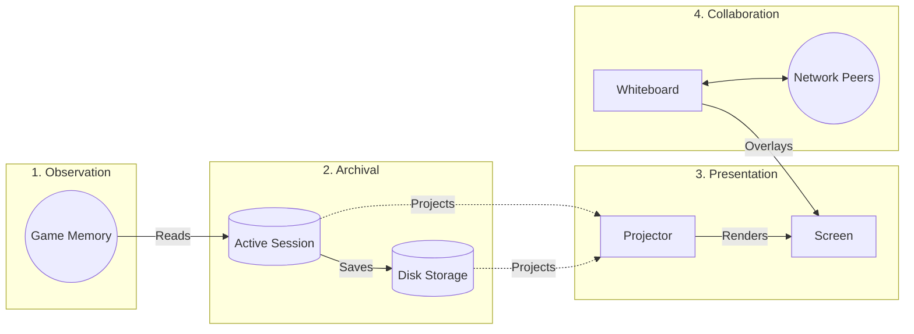

1. **Observation Flow:** Memory hooks and game-tick loops continuously siphon data out of the live game into a temporary active session buffer.

2. **Archival Flow:** Upon a wipe, the active session buffer is sealed, compressed, and written to disk.

3. **Presentation Flow:** When the user scrubs the timeline, the projector asks the archive for the data at that specific time offset, translates the coordinates to pixels, and renders the frame.

4. **Collaboration Flow:** When a user draws on the screen, the stroke is saved to the whiteboard layer and immediately broadcast to network peers. Peers update their own whiteboards. The network *never* transmits the archived combat data, only the whiteboard data and the current timeline position.

### Data Ownership and Boundaries

To prevent race conditions—especially during the chaotic moments of a raid wipe when network packets, disk saving, and UI rendering overlap—data ownership is strictly siloed.

* **Who Owns Data?**
* **The Session Manager** owns the active combat timeline. It is the only entity allowed to write new frames or events to the current pull.

* **The Storage Manager** owns the archived files. It is responsible for compressing them and deleting old ones.

* **The Canvas Controller** owns the whiteboard. It maintains the list of user drawings and handles the undo/redo history.

* **Who Merely Observes Data?**
* **The Capture Hooks** only observe the game memory. They do not own the memory and cannot change the game state.

* **The Renderer** only observes the archived replays and the whiteboard. It cannot alter a replay frame or modify a drawing; it only reads them to generate pixels.

* **The Network Manager** observes the canvas state to broadcast changes, and pushes incoming changes to the Canvas Controller. It does not own the drawings.

# 3. Plugin Lifecycle

To ensure stability within the Final Fantasy XIV client, Aether Blackbox must behave as a polite guest. It must initialize cleanly without halting the game's startup, operate invisibly until needed, and completely erase its footprint upon disposal. A failure to clean up memory hooks or unmanaged textures during a plugin reload will result in a hard client crash.

The lifecycle is defined by three distinct phases: Bootstrapping, Runtime Observation, and Teardown.

### Phase 1: Bootstrapping & Service Construction

When Dalamud loads the plugin, execution begins in the `Plugin` constructor. The immediate goal is to establish the dependency graph and hook into the game engine before the user can interact with the UI.

**1. Global Service Locator Initialization**
The very first action is initializing a static IoC (Inversion of Control) container via `Service.Initialize()`.

* *Architectural Intent:* While dependency injection is generally preferred, passing a dozen `[PluginService]` attributes down through five layers of UI and replay logic introduces massive boilerplate. `Service.cs` acts as a static locator for global Dalamud services (like `ClientState`, `Framework`, and `ObjectTable`), keeping business logic signatures clean.

**2. Subsystem Construction**
The `Plugin` class is the absolute root owner of the application. It creates two parallel systems:

* **The Replay System:** Instantiates the `ConditionEvaluator`, `PullManager`, `PositionRecorder`, and `CombatEventCapture`. This establishes the headless data collection backend. Crucially, `CombatEventCapture` initializes its memory hooks immediately upon creation, allowing the plugin to monitor combat packets in the background.

* **The Drawing System:** Instantiates the `WindowSystem` and all ImGui panels (`MainWindow`, `ToolbarWindow`, etc.).

**3. Framework Registration**
Finally, the plugin attaches its entry points to the host environment:

* Binds `WindowSystem.Draw` to Dalamud's `UiBuilder.Draw` tick.

* Registers chat commands (`/abb`).

* Exposes its Inter-Plugin Communication (IPC) provider (`AetherBlackbox.GetLastPullMetadata`) so companion plugins like AetherDraw can request replay data.

### Phase 2: Runtime Observation

Once initialized, the plugin enters a passive monitoring state. Its runtime behavior is dictated by event-driven transitions rather than a monolithic update loop.

**The Combat Trigger**
The plugin listens to Dalamud's `ConditionChange` event, specifically watching for `ConditionFlag.InCombat`.

* *When Combat Starts (`value == true`):* The `Plugin` commands the `PullManager` to start a new session and tells the `PositionRecorder` to begin its 66ms sampling loop.

* *When Combat Ends (`value == false`):* The `PositionRecorder` is halted, and the `PullManager` finalizes the session.

* *Design Trade-off:* Relying on the `InCombat` flag means the plugin depends on the server's definition of combat. While this occasionally causes split-second delays in logging the start of a pull, it completely eliminates the need for expensive, manual heuristic checks (e.g., constantly polling player enmity or aggro lists every frame) to determine if a fight has begun.

**The UI Loop**
Independent of the combat trigger, Dalamud fires `UiBuilder.Draw` every frame. If a window is open, it executes its drawing logic. Because the UI reads from the immutable `ReplayRecording` data structures rather than live memory, opening the UI mid-combat does not interfere with the `PositionRecorder`'s background sampling.

### Phase 3: Teardown & Disposal

When a user disables the plugin or updates it, Dalamud invokes the `Dispose()` method. Strict ownership cascades downwards here. The `Plugin` must manually tear down everything it built to prevent memory leaks and client instability.

**Disposal Sequence:**

1. **Detach Framework:** The IPC provider is unregistered, chat commands are removed, and UI drawing callbacks are unhooked. This prevents the game from executing logic on objects that are about to be destroyed.

2. **Halt Async Operations:** `NetworkManager.Dispose()` is called, which cancels the WebSocket listener `CancellationToken` and gracefully closes the socket connection.

3. **Restore Game Memory:** `CombatEventCapture.Dispose()` disables and disposes of the memory detours (`processPacketActionEffectHook`, etc.). *Invariant:* Failing to release these hooks will cause the game to branch into deallocated memory space the next time an ability is used, causing an immediate crash.

4. **Flush GPU Memory:** `TextureManager.Dispose()` iterates through all cached `IDalamudTextureWrap` objects and calls their internal dispose methods. *Invariant:* Unmanaged DirectX/Vulkan texture memory is not automatically garbage collected by the .NET runtime. It must be explicitly flushed.

5. **Clear State:** All windows are removed from the `WindowSystem`, and active replays are dropped from RAM.

### Lifecycle Sequence Diagram

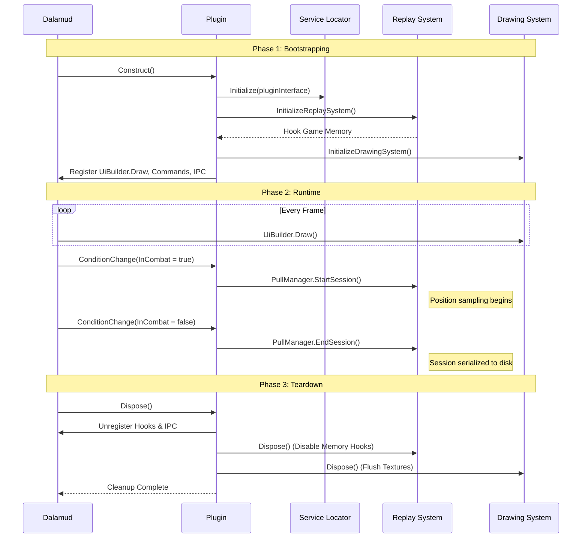

# 4. Major Subsystems

The architecture isolates operations into decoupled subsystems to prevent performance bottlenecks and enforce strict boundaries between data collection, storage, and presentation.

The subsequent sections will detail the purpose, design goals, lifecycle, and interaction model for each of the following:

**4a. Capture & Event Subsystem**
Intercepts live game memory and normalizes it into an immutable timeline of combat events and positional data.

**4b. Replay & Storage Subsystem**
Manages the lifecycle of combat encounters, determining when a session begins, ends, or is discarded, and orchestrates the asynchronous compression and archival of history to disk.

**4c. Presentation & Rendering Subsystem**
Projects abstract, three-dimensional combat history onto a two-dimensional interface, aggressively filtering irrelevant data to maintain rendering speed.

**4d. Drawing & Annotation Subsystem**
Manages the interactive, vector-based telestration layer, ensuring user markings remain completely isolated from historical combat data.

**4e. Networking & Synchronization Subsystem**
Coordinates real-time collaboration across remote peers using a hybrid protocol, keeping visual annotations and timeline positions synchronized without broadcasting heavy historical files.

**4f. Mechanics & Preset Subsystem**
Automates the visualization of predefined hazards by matching combat triggers against a database of shapes, durations, and territory backgrounds.

### 4a. Capture & Event Subsystem

**Purpose**
The Capture & Event subsystem is the "Observer" of the architecture. It is responsible for intercepting the volatile state of the live game, extracting combat data, and translating it into safe, managed C# objects that can be historically archived without retaining unsafe memory pointers.

**Design Goals & Philosophy**
The primary design goal is **zero-interference performance**. The subsystem must execute its extraction logic in a fraction of a millisecond to avoid stuttering the game client during heavy raid encounters.

To achieve this, the architecture splits capture into two separate modalities:

1. **Continuous Sampling (`PositionRecorder`):** Tracks positional data (X, Z, Rotation) and fluctuating attributes (HP, Cast Bars).

2. **Discrete Hooking (`CombatEventCapture`):** Intercepts instantaneous occurrences (damage dealt, buffs applied, deaths).

*Why the split?* If the system only used continuous sampling on the framework tick, it would completely miss burst damage or buffs that are applied and consumed between ticks. Conversely, if it hooked every single movement packet over the network, the sheer volume of events would choke the plugin. Splitting them balances high fidelity for critical events with memory efficiency for movement.

**Responsibilities & Execution Flow**

* **Memory Hooks:** `CombatEventCapture` uses Dalamud's `IGameInteropProvider` to insert function detours into FFXIV's internal `ActionEffectHandler` and `PacketDispatcher`. When the server sends a combat packet, execution routes through the plugin's detour, parses the raw C++ structs (`ActionEffectHandler.Header`, `ActionEffectHandler.TargetEffects`), and returns execution to the game.

* **Time-Boxing:** The `PositionRecorder` binds to the `Framework.Update` event but enforces a strict `66.0 ms` interval check before doing any work. If 66ms haven't passed, it bails out immediately.

* **Object Normalization:** Raw memory data is highly volatile. The subsystem uses factory patterns (`SnapshotFactory`, `CombatEventFactory`) to immediately copy essential data out of unmanaged space and into immutable, managed `CombatEvent` records.

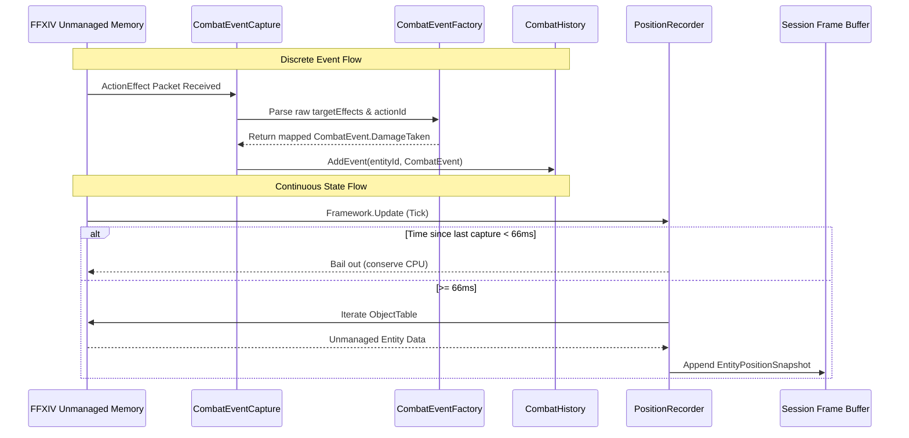

**Boundaries & Assumptions**

* **Unidirectional Data Flow:** This subsystem *only reads* from the game. It is strictly forbidden from writing to game memory or modifying packet payloads.

* **UI Ignorance:** The capture subsystem has zero knowledge of ImGui or the rendering pipeline. It pushes data into `CombatHistory` or `PullSession` buffers and abandons ownership.

* **Fuzzy Entity Matching:** Because entities can spawn and despawn, the subsystem relies on cross-referencing `EntityId` with a `MetadataRecorder`. If an action targets an ID that isn't in the metadata cache, the capture pipeline will attempt to lazily resolve the actor's job/name on the fly.

**Ownership & Lifecycle**

* **Lifetime:** Both `CombatEventCapture` and `PositionRecorder` are instantiated by the main `Plugin` class during startup and live for the entire duration of the plugin's execution.

* **Hook Lifecycle:** Memory detours (`processPacketActionEffectHook`, etc.) are enabled immediately upon initialization.

* **Disposal Invariant:** When `Dispose()` is called, these hooks *must* be disabled and freed. If the plugin is reloaded without releasing the hooks, the game client will attempt to execute code at an orphaned memory address and crash.

**Design Trade-offs & Pitfalls**

* **Patch Fragility vs. Accuracy:** Hooking directly into `ActionEffectHandler` provides perfect damage and buff attribution, but it makes the plugin extremely brittle to FFXIV patch updates. Struct layouts (`EffectResult`, `StatusEffectAddEntry`) will break when the game updates.

* **Graceful Degradation:** To mitigate patch fragility, the `InitializeHooks` method wraps the riskiest detours in a `try/catch` block. If the struct signatures change, the plugin logs the error, disables buff/debuff tracking, but allows positional recording and the UI to remain functional.

**Extension Points**

* **Tracking New Events:** To capture a new game mechanic (e.g., limit breaks or specific tether types), a contributor must:
1. Identify the relevant `ActorControlCategory` or `ActionEffectType` in the `Game` definitions.

2. Add a new detour case in `CombatEventCapture`.

3. Create a corresponding C# record in `CombatEvent.cs`.

4. Implement the parsing logic in `CombatEventFactory` to translate the unmanaged memory into the new record.

### 4b. Replay & Storage Subsystem

**Purpose**
The Replay & Storage subsystem is the "Archivist" of the architecture. It owns the temporal boundaries of a combat encounter, determining when a fight begins, when it truly ends, and how that volatile memory is transformed into persistent, shareable storage.

**Design Goals & Philosophy**
The primary design goal is **non-blocking persistence and stable memory footprint**.
Combat in FFXIV can generate tens of thousands of coordinate and event points over a 15-minute encounter. Writing this data to disk synchronously at the moment of a wipe would cause the game client to stutter or freeze. Therefore, the storage subsystem is built around asynchronous serialization, background compression, and queued read operations.

Furthermore, the subsystem is designed to defend against "garbage" data. Because combat flags in FFXIV can toggle from benign events (e.g., gaining aggro on a striking dummy), the subsystem actively discards empty sessions to prevent memory bloat.

**Responsibilities & Execution Flow**

* **Session Lifecycle Management:** `PullManager` is the sole authority for creating `PullSession` objects. When triggered by the capture subsystem, it initializes a new session and commands the `PositionRecorder` to begin.

* **The Grace Period:** When a wipe occurs, `PullManager.EndSession()` seals the recording. However, because network packets (like the final fatal damage or the death notification itself) may arrive late due to server latency, `PullManager` allows a 15-second grace period where newly arriving `Death` events can still be attached to the recently closed session.

* **Asynchronous Archival:** Once finalized, `PullManager` hands the session to `ReplayFileManager`. The file manager serializes the data to JSON, compresses it using `GZipStream`, and writes it to disk on a background `Task`.

* **Queued Loading:** When a user requests to view an older replay, `PullManager` places a `ReplayLoadRequest` into a `ConcurrentQueue`. A dedicated background loop processes this queue, decompressing and parsing the file so the main UI thread never hangs.

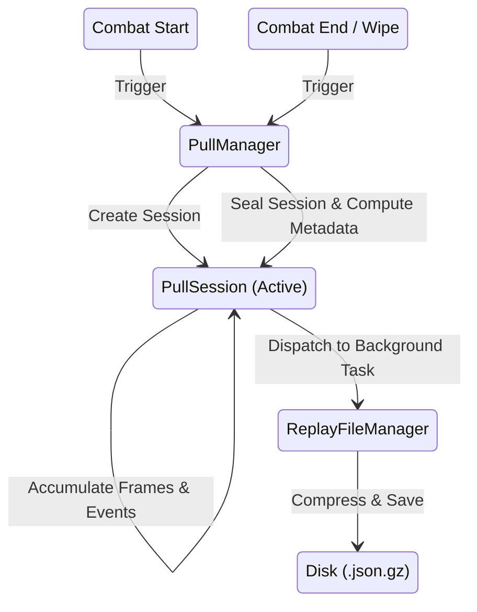

**Boundaries & Assumptions**

* **Isolation from Rendering:** The storage subsystem does not know how data will be drawn. It simply provides the completed `PullSession` to the `History` list, which the `MainWindow` observes.

* **Decoupled Drawings:** The replay files saved by this subsystem contain only game state (combat frames, waymarks, events, and metadata). User annotations and drawings are *not* saved into these replay files, as drawings belong to the collaborative UI layer, not the raw combat history.

**Ownership & Lifecycle**

* **Lifetime:** `PullManager` and `ReplayFileManager` are instantiated at plugin startup and live until disposal.

* **Data Retention:** `ReplayFileManager` automatically executes a cleanup task on startup, deleting `.json.gz` files older than the user's configured retention limit (default 14 days) to prevent the plugin directory from ballooning in size.

* **Memory Management:** `PullManager` maintains a `History` list of recent sessions in RAM for instant playback. If a session is deemed "junk" (zero damage and zero deaths), it is silently dropped from history upon the next pull.

**Design Trade-offs & Pitfalls**

* **GZip vs. Raw JSON:** Replays are serialized as compressed GZip archives rather than plaintext JSON. While this makes the files illegible to standard text editors without extraction, it reduces the file size of a 10-minute encounter from ~50MB to ~3MB, significantly speeding up disk I/O and network transmission.

* **Metadata Header Separation:** Because decompressing a 3MB GZip file just to read the boss's name is computationally expensive, `ReplayFileManager` writes a plaintext JSON `SearchHeader` to the file *before* the GZip stream begins. This allows the history UI to rapidly scan a directory of replays and display titles without loading them into memory.

* **File Name Sanitization Pitfall:** The subsystem infers the `ZoneName` and `BossName` dynamically from the entity with the highest maximum HP. Because these names are used to generate the physical file name, invalid characters must be strictly sanitized to prevent `IOException` crashes during archival.

### 4c. Presentation & Rendering Subsystem

**Purpose**
The Presentation & Rendering subsystem acts as the "Projector." Its sole responsibility is to translate abstract, three-dimensional combat history into a two-dimensional interface that users can interact with.

**Design Goals & Philosophy**
The primary architectural goal here is **framerate protection via aggressive decoupling and caching**.
The game client updates the screen up to 144 times a second. If the presentation layer performs heavy calculations, touches the disk, or reads live memory during this loop, the entire game will stutter.

To solve this, the subsystem enforces a strict read-only boundary: it accepts a requested timestamp, looks up the pre-calculated frame in the archive, and draws it. It does not calculate physics, it does not interpolate between frames, and it never performs disk I/O on the render thread.

**Responsibilities & Execution Flow**

* **Coordinate Transformation:** The game operates in 3D space (X, Y, Z), but raid mechanics are fundamentally planar. The `CanvasProjector` and `ReplayRenderer` discard the Y-axis (height) entirely. They apply a hardcoded mathematical translation: `1 in-game yalm = 8 UI pixels` (`DefaultPixelsPerYard`). This constant ensures that the resulting overlays precisely match community-standard strategy maps.

* **Frame Snapping (No Interpolation):** When scrubbing the timeline, the system uses a binary search (`GetClosestFrame`) to find the nearest 66ms recorded snapshot. *Why no linear interpolation?* Interpolating positions between ticks requires expensive math for every entity every frame, and it artificially smooths out movements, potentially hiding micro-stutters or snap-backs that actually caused the wipe.

* **Information Culling:** The renderer actively hides irrelevant data. For example, it filters out permanent player stances (durations > 300s) and Free Company buffs. *Why?* Screen real estate is limited; drawing 15 buff icons over every player obscures the crucial mechanic debuffs the user is actually looking for.

**The Texture Caching Strategy (Critical Trade-off)**
Rendering relies heavily on job icons, mechanic SVGs, and arena backgrounds. Loading an SVG from disk takes several milliseconds—an eternity for a render loop.

To bypass this, `TextureManager` uses a multi-threaded staging architecture:

1. When a texture is requested, the renderer immediately returns `null` if it isn't in RAM, bypassing the draw call for that frame.

2. The request is pushed to a background worker, which loads the file from disk, rasterizes SVGs via SkiaSharp, or downloads it via HTTP.

3. The background worker converts the image into a raw byte array and pushes it to a thread-safe `ConcurrentQueue`.

4. On the main thread, before the draw loop begins, the system drains this queue and pushes the bytes into the GPU via the framework's texture provider.

This ensures the render thread never blocks waiting for an image to decode.

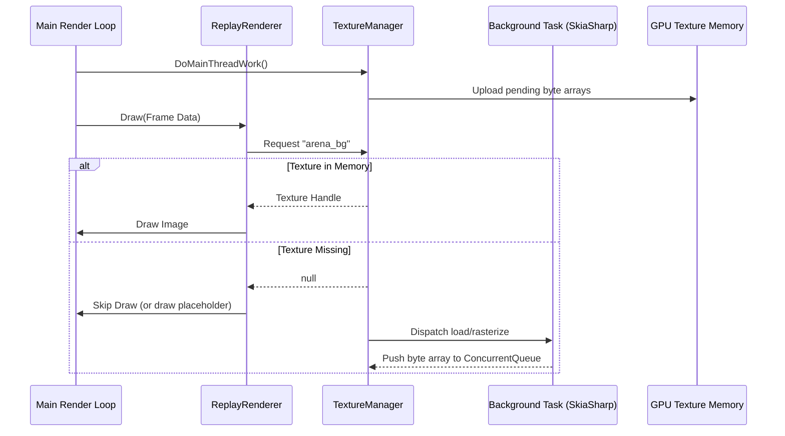

**Boundaries & Assumptions**

* **Stateless Projection:** The renderer has no memory of the previous frame. It draws exactly what is passed to it.

* **Read-Only Data:** The renderer assumes the `ReplayRecording` it is handed is fully immutable. It must never alter HP values or coordinates.

**Ownership & Lifecycle**

* **Lifetime:** `ReplayRenderer` is instantiated by `MainWindow` and lives as long as the UI exists. `TextureManager` is static to share cache across all windows, but its `Dispose()` routine is manually invoked during plugin teardown to flush unmanaged GPU memory.

* *Invariant:* Failing to call `Dispose()` on the cached textures will leak unmanaged GPU resources across plugin reloads, eventually crashing the client.

**Extension Points**

* **Adding Visual Filters:** To add new logic for hiding specific NPCs or status effects, contributors should modify the exclusion blocks inside `DrawPlayerMechanicStatuses` and the entity iteration loop in `ReplayRenderer.cs`.

### 4d. Drawing & Annotation Subsystem

**Purpose**
The Drawing & Annotation subsystem acts as the "Transparent Whiteboard." It manages the interactive, vector-based telestration layer, ensuring user markings remain completely isolated from the immutable historical combat data.

**Design Goals & Philosophy**
The fundamental philosophy of this subsystem is **mathematical vector representation over pixel rasterization**.
When a user draws a line, the system does not create an image layer and color pixels. It simply records `StartPoint`, `EndPoint`, `Thickness`, and `Color`.

*Why?*

1. **Infinite Resolution:** Users can zoom in on the arena infinitely during a replay, and vector drawings will never become pixelated or blurry.

2. **Microscopic Network Payloads:** Synchronizing a drawing over the network requires sending only a few bytes (the mathematical coordinates) rather than a heavy serialized bitmap, making real-time collaboration instantaneous.

3. **Export Scaling:** When exporting a strategy plan via ImageSharp, the vectors can be flawlessly rasterized at any target resolution.

**Responsibilities & Execution Flow**

The subsystem operates as a state machine driven by mouse inputs captured in `MainWindowCanvas` and routed to the `CanvasController`.

* **Creation State:** When the user clicks with a tool selected (e.g., `DrawMode.Rectangle`), `CanvasController` instantiates a new `BaseDrawable` derivative. As the user drags, `UpdatePreview(mousePos)` is called every frame, altering the mathematical bounds of the shape without committing it.

* **Interaction State:** If the user is in `Select` mode, `ShapeInteractionHandler` takes over. It draws manipulation handles (resize, rotate) around the selected shape.

* **Commitment:** To avoid flooding the `UndoManager` and the network, intermediate drag frames are *not* recorded. Only when the user releases the mouse button (`isLMBReleased`) does the `CanvasController` finalize the mathematical change, snapshot the page state into the `UndoManager`, and fire the `onObjectsCommittedCallback` to broadcast the final coordinates to peers.

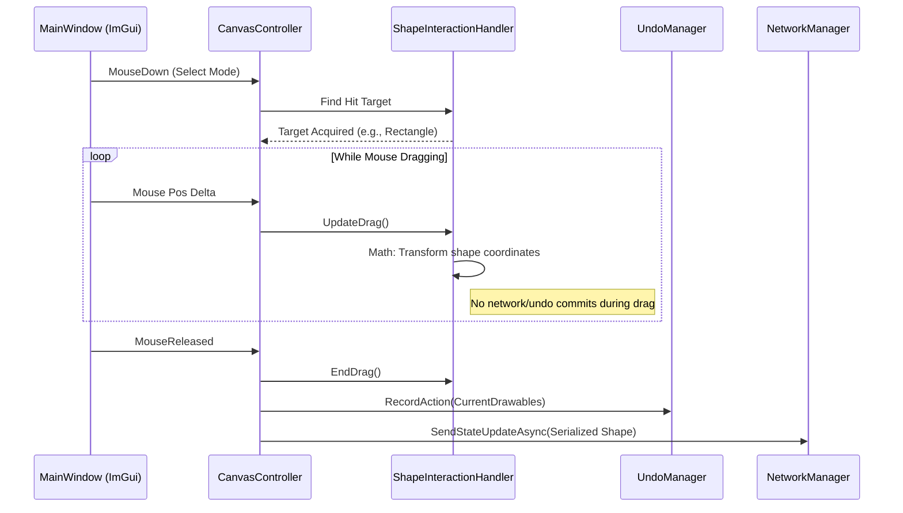

**The Math of Hit Detection (Architectural Decision)**
A major complexity in vector graphics is determining if a mouse click intersects with a rotated shape. Calculating complex rotated polygons is CPU-intensive.
Instead, the subsystem uses **inverse transformations**.
When checking if a cursor hit a rotated rectangle, the `HitDetection` logic takes the mouse coordinate, translates it by the rectangle's center, applies an inverse rotation matrix to "un-rotate" the mouse into the shape's local coordinate space, and then performs a highly efficient Axis-Aligned Bounding Box (AABB) check.

**Ephemeral Objects (The Laser Exception)**
Most `BaseDrawable` objects are persistent, but `DrawableLaser` violates standard subsystem rules.

* It ignores the `UndoManager` (its `Clone()` returns null).

* It holds a `DateTime` timestamp for every point to calculate a fading opacity tail.

* It self-destructs. When the user finishes drawing a laser, an async `Task.Delay(600)` is fired that explicitly sends a `DeleteObjects` network payload to erase it from peers after 600ms.

**Boundaries & Assumptions**

* **Total Ignorance of Combat:** A `BaseDrawable` has no knowledge of what a boss or a player is. It only knows its logical X and Y coordinates. If a shape is meant to "track" an entity, the `CanvasController` manually updates the shape's offset relative to the entity's world position during the projection phase.

* **Decoupled Z-Indexing:** Layer rendering order is strictly determined by the array index in the `PageManager`'s list, overridden slightly by `GetLayerPriority` to ensure text and markers always draw on top of filled shapes.

**Ownership & Lifecycle**

* **Active Ownership:** The `PageManager` owns the active list of drawings for the current session.

* **Historical Ownership:** The `UndoManager` owns deep copies (clones) of the `PageManager`'s lists at various points in time. *Invariant:* Failing to deep-clone objects when pushing to the Undo stack will result in references mutating retroactively, corrupting the undo history.

* **Disposal:** Drawings are automatically garbage collected when the `PageManager` clears the page or the session changes.

### 4e. Networking & Synchronization Subsystem

**Purpose**
The Networking & Synchronization subsystem acts as the "Communicator." It links remote users together, keeping their visual annotations, laser pointers, and timeline positions perfectly matched in real-time.

**Design Goals & Philosophy**
The core philosophy is **lightweight, event-driven syncing**.
Sending a 3MB encounter file across the network every time a user scrubs the timeline would introduce massive latency. Instead, the architecture relies on a shared baseline: it assumes all connected users already possess the identical combat history locally. Therefore, the network only transmits tiny instructional commands, such as "jump to 03:15" or "draw a red circle at these exact coordinates."

**Responsibilities & Execution Flow**

* **Connection Management:** A background listener establishes and maintains a steady communication channel (WebSocket) with the relay server. It monitors connection health and handles automatic reconnections if a dropout occurs.
* **State Broadcasting:** When a user finalizes a new drawing on their whiteboard or moves the timeline slider, the drawing manager hands the finalized mathematical coordinates to the network manager. The network manager packages these coordinates into a minimal text payload and broadcasts it to all peers.
* **Instruction Unpacking:** The background listener constantly waits for incoming messages. When a payload arrives (e.g., a peer's new drawing), it parses the math and injects the shape directly into the local drawing manager. The local screen updates on the very next render cycle.

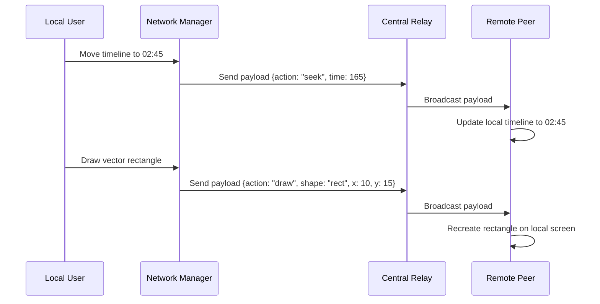

**Boundaries & Assumptions**

* **Local Data Requirement:** The network manager is strictly prohibited from transferring actual historical combat files. If a remote peer does not have the corresponding encounter file saved on their computer, the connection handshake will gracefully reject them from joining that specific replay.
* **Background Isolation:** Network traffic reading and writing occur entirely apart from the main user interface. If the network lags or the server stops responding, the local drawing and replay viewing experience remains perfectly smooth.

**Ownership & Lifecycle**

* **Startup and Teardown:** The network manager is brought online during the initial startup sequence. When the main tool is shut down, the teardown sequence explicitly commands the network manager to cancel its listening tasks and safely sever the socket connection.
* **Safety Invariant:** Failing to cleanly sever the background network socket during teardown will leave invisible background tasks running, which will eventually exhaust available memory and crash the game.

**Design Trade-offs & Pitfalls**

* **Conflict Resolution vs. Speed:** To maintain instant responsiveness, the system bypasses complex lock-step conflict resolution. It operates on a "last message wins" principle. If two users manipulate the same shape simultaneously, whoever's network packet arrives at the relay last will dictate the final position of the shape.
* **The Laser Pointer Exception:** Standard drawings are saved to the permanent historical list, but laser pointers are ephemeral. The network manager sends a creation message for a laser, and then automatically queues a deletion message 600 milliseconds later to ensure the laser vanishes from all peers simultaneously.

### 4f. Mechanics & Preset Subsystem

**Purpose**
The Mechanics & Preset subsystem acts as the "Director." It automates the visualization of complex raid hazards by matching incoming combat triggers against a strictly defined database of geometric shapes, durations, and background environments.

**Design Goals & Philosophy**
The primary goal is **predictable, automated visualization without manual drawing**.
Because FFXIV combat mechanics are deterministic (a specific boss casting a specific spell always results in a specific hazard), this subsystem eliminates the need for manual telestration. It automatically projects danger zones onto the arena precisely when they occurred in the timeline, allowing the user to focus on strategy rather than recreating the game's native warning markers.

**Responsibilities & Execution Flow**

* **Trigger Recognition:** The subsystem actively monitors the historical timeline during playback. It scans for specific identifiers, such as a boss beginning a known cast sequence or a specific territory ID loading.
* **Shape Generation:** Upon matching a known identifier, the system consults its preset library to determine the hazard's exact properties: shape (circle, cone, line), dimension, safe zones, and lifespan.
* **Canvas Injection:** The generated shape is temporarily injected into the rendering loop. It acts visually like a user-drawn vector but remains entirely automated and uneditable.
* **Environment Loading:** It dictates the background graphic presets and landing page layout options based on the detected zone, swapping the visual context to match the specific encounter.

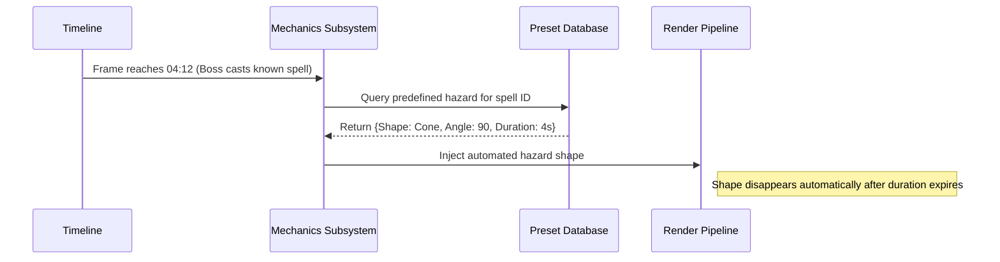

**Boundaries & Assumptions**

* **Read-Only Presets:** The hazard database is immutable during runtime. Users cannot edit the core mechanic timings, dimensions, or logic from within the application interface.
* **Visual Priority:** Automated mechanics are designed to draw underneath user-created annotations. This strict layering ensures that custom strategy markings and laser pointers always remain visible over the automated danger zones.

**Ownership & Lifecycle**

* **Ephemeral Nature:** Automated shapes do not exist in the permanent history file. They are generated on the fly during playback and instantly destroyed when the timeline scrubs past their expiration window.
* **Disposal:** Background graphics and loaded hazard textures are safely flushed from memory when the encounter territory changes or the plugin is shut down, preventing resource bloat over long sessions.

**Design Trade-offs & Pitfalls**

* **The Maintenance Burden:** Hardcoding mechanic presets requires manual, systemic updates for every new raid release. Supporting major content additions—such as integrating the specific territory identification logic, custom purple-and-yellow vector textures, and dedicated UI presets for the "Dancing Mad (Ultimate)" encounter—demands continuous upkeep of the preset database to ensure visual accuracy.
* **Fuzzy Matching Vulnerability:** If the game developer alters the underlying spell ID or casting duration in a minor patch, the automated preset will fail to trigger or will display incorrectly. The subsystem relies entirely on the stability of these underlying game identifiers.

# 5. Data Model

This section details the primary runtime structures that hold combat history and user annotations.

### Core Architectural Philosophy: Strict Immutability

Once data is extracted from the live game client, it is immediately converted into immutable records. This guarantees that background serialization tasks, network broadcasting, and the render thread can all read the same memory simultaneously without requiring locks.

### 1. The Encounter Root (`PullSession` / `ReplayRecording`)

The primary container for a single combat attempt.

* **Ownership:** Created and owned by `PullManager`.
* **Lifetime:** Exists in RAM from the moment combat starts until the user closes the plugin or the session falls out of the recent history cache.
* **Relationships:** Contains a list of `EntityPositionSnapshot` arrays, a list of `CombatEvent` records, and metadata (Zone, Boss).
* **Serialization:** Converted to JSON, compressed via GZip, and saved to disk.

### 2. Continuous State (`EntityPositionSnapshot`)

Represents the physical state of an actor at a specific 66ms tick.

* **Ownership:** Appended to the `PullSession` buffer by the `PositionRecorder`.
* **Mutability:** Strictly immutable upon creation.
* **Indexing & Lookup:** Stored in a flat array sorted by relative time (`T+0.0`). The renderer locates the correct frame using a binary search against the requested timestamp. This guarantees `O(log N)` lookups during playback.

### 3. Discrete Actions (`CombatEvent`)

Represents instantaneous occurrences like damage, healing, or aura applications.

* **Ownership:** Captured by `CombatEventCapture`, immediately pushed to the `PullSession`.
* **Mutability:** Immutable.
* **Relationships:** Linked to specific actors via `EntityId`. If an entity despawns, the historical ID remains intact for the UI to resolve later.

### 4. Interactive Annotations (`BaseDrawable`)

Mathematical vector representations of user drawings (rectangles, lines, text).

* **Ownership:** Owned by the `PageManager` for active display, and by the `UndoManager` for historical state.
* **Lifetime:** Ephemeral. They exist only during the active viewing session and are discarded when a new replay is loaded. They are never saved to the core replay file.
* **Mutability:** Mutable only during the "drag" state of creation. Once the user releases the mouse, the object becomes fixed, and any further modification results in a completely new object being pushed to the undo stack.

### Structural Diagram

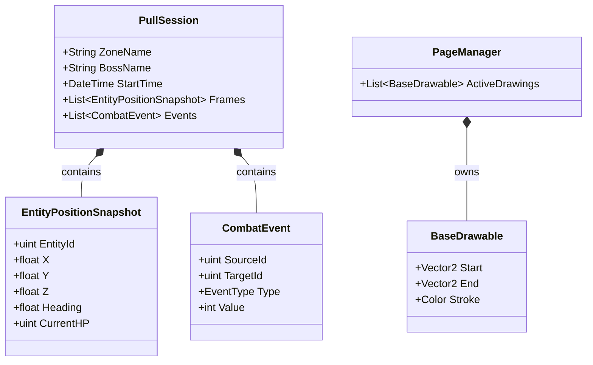

### Information Flow & Transformation

1. **Raw unmanaged memory** is read and parsed.
2. Data is transformed into **managed, immutable C# records** (`EntityPositionSnapshot`, `CombatEvent`).
3. Records are grouped into a **`PullSession`**.
4. The session is serialized into a **GZipped JSON file** for persistence.
5. During playback, the file is decompressed back into memory, where the renderer performs **binary search lookups** to project the data onto the 2D canvas alongside the user's **`BaseDrawable`** annotation layer.

# 6. Execution Flow

This section traces the critical execution paths of Aether Blackbox. The architecture relies on event-driven hooks and isolated background tasks rather than a monolithic update loop, ensuring the plugin never blocks the Final Fantasy XIV client.

### The Core Game Loop (Capture & Render)

Execution is driven by two parallel systems: FFXIV's `Framework.Update` tick (for state sampling) and `UiBuilder.Draw` (for presentation). They operate independently.

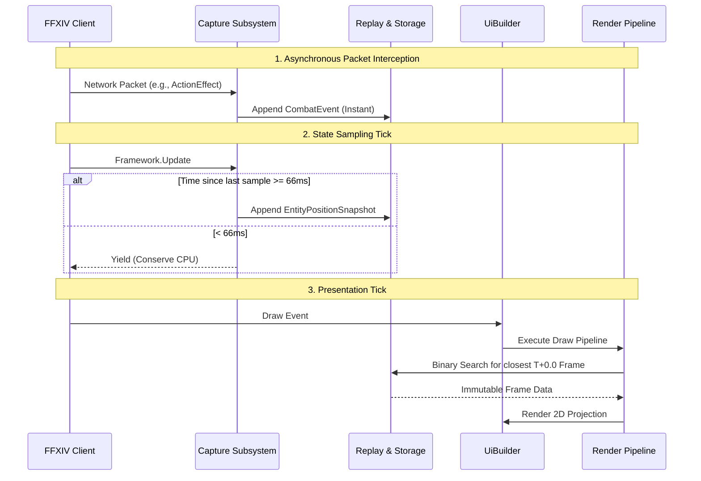

* **Architectural Intent:** By separating discrete packet hooks from continuous framework ticks, the plugin captures split-second damage values without forcing the CPU to sample physical actor coordinates at 144hz.

### Replay Construction & Archival

When an encounter concludes, the data must be moved out of volatile memory and onto the disk without freezing the game.

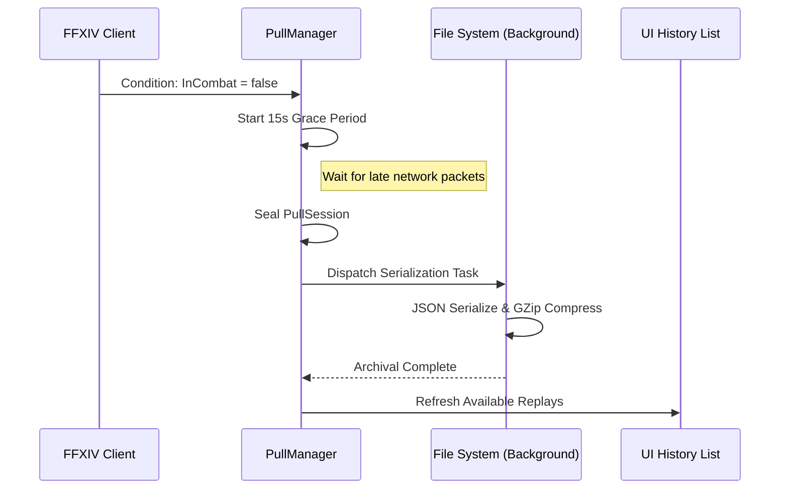

### Collaboration & Telestration (Network Flow)

Drawing and networking bypass the combat history entirely. User annotations are captured on the UI thread, committed, and broadcast asynchronously.

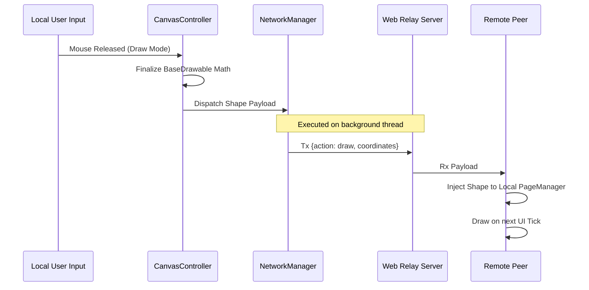

* **Execution Rule:** Network transmissions and disk I/O are strictly forbidden on the `UiBuilder.Draw` thread. All data leaving the plugin boundary is serialized on background `Task` workers to protect the client framerate.

# 7. Threading and Concurrency

The architecture relies on strict thread isolation. The primary directive is to protect the game's framerate. Blocking the main thread means freezing the game client.

### Thread Assignments

* **The Main Thread:** Owns all user interface rendering, user input, and drawing interactions. It also handles the continuous state sampling during the game's internal framework tick.
* **The Network Thread:** A dedicated background worker continuously listens for incoming remote peer data and broadcasts local changes.
* **The I/O Thread:** Independent background tasks handle loading, compressing, and saving historical files to the hard drive.
* **The Capture Thread:** Memory detours execute on whichever thread the game engine uses to process incoming server network packets.

### Synchronization Strategy

* **Immutability Over Locks:** The core concurrency strategy is absolute immutability. Once combat data is extracted from the live game, it is sealed into read-only records. Because historical data never changes, the background save routines, the network broadcaster, and the user interface can all read the exact same memory simultaneously without requiring any locks.
* **Concurrent Handoffs:** When a background routine finishes a heavy task (like decoding a large image or unzipping a history file), it pushes the result into a thread-safe concurrent queue. The main UI thread drains this queue at the start of its next draw cycle. This guarantees that background workers never directly manipulate interface elements.
* **Lock Usage:** Explicit locking is strictly minimized to prevent deadlocks and render stuttering. It is isolated entirely to the exact millisecond the system swaps the active recording buffer when a new encounter begins or ends.

### Asynchronous Workflows

* **Fire-and-Forget Archival:** Saving a file is dispatched as an independent background task. The main routine issues the save command and immediately abandons it, returning to rendering the game while the disk operation finishes silently.
* **Cancellation Tokens:** Long-running background listeners (like the collaborative network socket) are bound to cancellation tokens. During the teardown sequence, the main routine signals these tokens, forcing the background workers to cleanly sever their connections and exit gracefully before the plugin is wiped from memory.

# 8. Rendering Pipeline

The rendering pipeline is responsible for projecting historical combat data and user annotations onto a 2D interface. It enforces a strict read-only boundary, ensuring the presentation layer never alters the underlying encounter data.

### Coordinate Transforms & Projection

Final Fantasy XIV operates in 3D space, but raid maps and strategy telestration are fundamentally planar.

* **Dimensional Reduction:** The projector discards the Y-axis (height) completely.
* **Scale Translation:** Coordinates (X, Z) are converted to screen pixels using a hardcoded scaling factor (`1 in-game yalm = 8 UI pixels`). This constant guarantees that the visual representation aligns precisely with community-standard strategy maps.
* **Mathematical Hit Detection:** To determine if a user clicked a rotated vector shape, the pipeline avoids complex polygon intersection math. Instead, it translates the mouse coordinate by the shape's center and applies an inverse rotation matrix to "un-rotate" the mouse into the shape's local coordinate space. It then performs an extremely fast Axis-Aligned Bounding Box (AABB) check.

### Filtering & Information Culling

Screen real estate is scarce, and rendering thousands of buffs causes extreme visual clutter and framerate drops.

* **Aggressive Culling:** The pipeline actively filters out irrelevant entity data before it reaches the draw loop. For example, it permanently hides player stances with durations exceeding 300 seconds and ignores passive Free Company buffs.
* **Visual Priority:** By stripping away permanent state data, the renderer ensures that critical mechanic debuffs (like "Doom" or "Prey" markers) remain the only active icons on the screen, drawing the user's attention exactly where it belongs.

### Texture Management & Caching

Loading an SVG or image file from the disk blocks the thread for several milliseconds. Doing this on the render thread causes the game client to freeze.

* **Asynchronous Staging:** The texture manager employs a multi-threaded staging queue. If a requested texture (such as a boss icon or hazard marker) is not immediately available in RAM, the renderer returns `null` and entirely skips drawing that specific asset for the current frame.
* **Background Rasterization:** Simultaneously, a background task loads the file, rasterizes vector images via SkiaSharp, converts them into a raw byte array, and pushes the result to a thread-safe queue.
* **GPU Upload:** On the next main thread cycle, before the draw loop begins, the system drains the queue and pushes the bytes into the GPU. The image will appear seamlessly on the next frame.

### Rendering Order (Z-Indexing)

To maintain clarity, the pipeline enforces a strict Z-index hierarchy from bottom to top:

1. **Arena Background:** The localized map specific to the encounter.
2. **Automated Mechanics:** System-generated hazard zones and danger markers.
3. **Historical Entities:** Players, bosses, and NPCs, including their HP bars and status effects.
4. **User Annotations:** Custom vector drawings, lines, and shapes.
5. **Text & Tooling:** Text boxes and interactive UI elements always render on the absolute top layer to prevent them from being obscured by filled shapes.

### Performance Considerations

* **No Interpolation:** The renderer uses a binary search to find the closest recorded 66ms snapshot for any given timestamp. It explicitly does not interpolate movement between frames. Interpolation requires heavy CPU math per entity and artificially smooths movement, which can hide the micro-stutters that often cause raid wipes.
* **Stateless Execution:** The renderer retains no memory of the previous frame. It recalculates the projection matrix and draws the current frame from scratch every cycle.

# 9. Persistence

This section details how volatile combat encounters are translated into permanent, shareable files on the user's disk.

### Replay Format & Compression

The system stores combat history using GZip-compressed JSON (`.json.gz`).

* **The Format Decision:** Raw JSON was selected over a binary format (like MessagePack or Protobuf) to guarantee long-term maintainability and easier debugging. JSON allows developers to extract and inspect corrupted replays using standard text editors.
* **The Size Trade-off:** A 15-minute encounter sampled at 66ms generates roughly 50MB of plaintext JSON. Writing 50MB to disk synchronously causes severe I/O bottlenecking. GZip compression reduces this payload to approximately 3MB. The CPU cost of compressing the data on a background thread is a necessary trade-off to ensure the physical disk write completes almost instantly.

### The Metadata Header

Scanning a directory of 3MB GZip files just to populate the UI history list (Zone, Boss, Date, Duration) would require decompressing every file, resulting in massive CPU spikes and UI lockups.

* **Hybrid File Structure:** To solve this, the file format is split. The persistence layer writes a small, plaintext JSON `SearchHeader` directly to the start of the file, *followed* by the GZip stream containing the massive `PullSession` array.
* **Directory Scanning:** When the plugin boots, the history UI only reads the first few kilobytes of each file to parse the plaintext header. This allows the system to populate a list of hundreds of replays instantly without ever touching the compression algorithms.

### Serialization Pipeline

Serialization is strictly a background operation.

* **Asynchronous Handoff:** When a session concludes, the main thread seals the `PullSession` (rendering it immutable) and dispatches it to a background `Task`. The main thread immediately resumes rendering the game.
* **Thread Safety:** Because the `PullSession` is completely immutable after sealing, the background serialization thread reads the exact same memory references as the main UI thread without requiring any resource locks.

### Versioning & Migration Strategy

FFXIV patches routinely alter game mechanics, requiring the plugin's data structures to evolve. The persistence layer must guarantee that a replay recorded today remains playable two years from now.

* **Explicit Versioning:** Every `SearchHeader` includes a strict integer `SchemaVersion`.
* **Migration Pipeline:** When the file loader detects an outdated `SchemaVersion`, the JSON payload is routed through a migration pipeline before being cast to the current runtime models.
* **Additive Evolution:** The core compatibility strategy is additive. New properties added to `EntityPositionSnapshot` or `CombatEvent` must be nullable or have safe default fallbacks. If an older replay is loaded, missing fields simply default to zero or null, allowing the renderer to gracefully skip drawing the new data rather than throwing deserialization exceptions.

# 10. Architectural Invariants

This section defines the strict rules of the system. Violating these constraints will cause client crashes, corrupted data, or severe framerate drops.

### 1. The Immutability Rule

**Invariant:** Combat history records are strictly read-only after creation.
**Why:** Background file compression, network broadcasting, and the visual rendering loop all read this identical data simultaneously. If any routine modifies a value after it is recorded, it introduces race conditions that will corrupt the save file or crash the background workers.

### 2. The Main Thread Boundary

**Invariant:** Background workers must never interact with the game's native memory or the user interface.
**Why:** Final Fantasy XIV is not thread-safe. If a background routine attempts to read the game's entity list or draw a pixel on the screen, the game client will immediately crash. Background workers must push their results to a thread-safe queue, which the main thread drains during its next safe cycle.

### 3. The Render Time Limit

**Invariant:** The presentation pipeline must never wait for disk I/O, network responses, or heavy computations.
**Why:** The render cycle executes up to 144 times per second. Blocking this pipeline for even a few milliseconds to load an image from the hard drive will freeze the entire game client. All heavy lifting must be offloaded, and the renderer must skip drawing missing elements until the background tasks finish providing them.

### 4. Memory Detour Cleanup

**Invariant:** All memory hooks must be explicitly disabled and removed during the teardown sequence.
**Why:** If the plugin unloads but leaves an active hook in the game's memory space, the game will attempt to route execution to an empty address the next time a network packet arrives, resulting in an immediate and fatal client crash.

### 5. Unmanaged Memory Flushing

**Invariant:** Unmanaged GPU textures must be manually flushed during disposal.
**Why:** Standard garbage collection does not track DirectX/Vulkan texture memory. Failing to execute the manual disposal routines on cached images will permanently leak memory across plugin reloads until the system runs out of RAM.

### 6. Additive Serialization Contracts

**Invariant:** Existing properties in the saved history data format cannot be renamed, repurposed, or removed.
**Why:** The system must be able to load older replay files indefinitely. Removing or changing a core field will break the migration pipeline, rendering years of community encounter histories unreadable. New data types must always be added alongside safe default fallbacks.

# 11. Design Decisions and Trade-offs

This section outlines the primary architectural choices, the alternatives considered, and the long-term consequences of these decisions.

### 1. Immediate Immutability Over Mutable State

* **The Decision:** Converting live game data into strictly read-only records the moment it is captured, rather than updating existing memory structures.
* **Alternatives:** Maintaining a mutable history state and using resource locks (mutexes) to ensure thread safety when background tasks read the data.
* **Why Chosen:** Resource locks inevitably cause thread contention. If a background disk operation holds a lock slightly too long, the main rendering thread must wait, causing the game client to stutter. Strict immutability completely eliminates the need for locks during read operations.
* **Consequences:** This approach creates a higher volume of memory allocations, as every tick creates new records instead of overwriting old ones. This relies heavily on the runtime's garbage collector, which must be carefully managed to avoid memory pressure.

### 2. GZip Compressed JSON Over Binary Serialization

* **The Decision:** Saving encounter files as compressed plaintext JSON.
* **Alternatives:** High-performance binary formats like Protobuf, MessagePack, or a custom binary stream.
* **Why Chosen:** Long-term maintainability and ease of debugging. When a file is corrupted or a migration fails, developers and users can easily decompress the file and inspect the raw text to identify the error. Binary formats obscure the data and make manual recovery extremely difficult.
* **Consequences:** The data occupies significantly more RAM before compression, and the background compression phase requires more CPU cycles than writing a direct binary stream.

### 3. No Frame Interpolation

* **The Decision:** The presentation layer snaps strictly to the closest recorded 66ms snapshot without attempting to smooth movement between these ticks.
* **Alternatives:** Mathematical interpolation (calculating intermediate coordinates) between historical frames for visually smooth playback.
* **Why Chosen:** The tool is designed for precise mechanical analysis. Interpolation artificially invents movement that never actually occurred on the server, masking micro-stutters and positioning errors that often cause raid failures.
* **Consequences:** Visual playback appears slightly staggered, exactly mirroring the discrete update steps of the underlying game engine.

### 4. Hybrid File Structure (Header + Payload)

* **The Decision:** Injecting an uncompressed, plaintext metadata header immediately preceding a large GZip data stream in the same file.
* **Alternatives:** Keeping an independent database file (like SQLite) to track all encounter metadata, or forcing the system to decompress every replay file to read its contents.
* **Why Chosen:** A separate database file can easily become desynced from the actual file system if a user manually moves or deletes files in their operating system. Decompressing every file to read metadata would freeze the interface. The hybrid approach allows the interface to instantly scan directories and read the first few bytes of each file for metadata, keeping the history list perfectly synced with the hard drive.
* **Consequences:** This requires custom file streaming logic during saving and loading, bypassing standard, out-of-the-box compression wrappers that expect to own the entire file stream.

# 12. Extension Guide

This section outlines the architectural workflow for integrating new functionality into the system without violating thread safety or serialization constraints.

### Integrating New Replay Data & Persistence Fields

When capturing new data types from the game client:

* **Additive Schema Modification:** Add new fields to the `EntityPositionSnapshot` or `CombatEvent` records as nullable types or with explicit default values.
* **Migration Pipeline:** Update the data loader to handle historical files lacking these new fields. Older files must deserialize cleanly without throwing exceptions, utilizing the default fallbacks so the renderer can gracefully skip the missing data.
* **Immutability:** Ensure the newly captured data is sealed and made strictly read-only before it is appended to the active `PullSession`.

### Adding New UI Features

When extending the presentation layer:

* **Read-Only Operations:** New UI panels must strictly read from the immutable session data. They must never attempt to modify historical states.
* **Thread Safety:** The UI executes on the main `UiBuilder.Draw` thread. Do not perform disk reads, heavy math, or blocking network calls inside UI rendering logic.

### Implementing New Rendering Features & Mechanics

When creating new automated hazard zones or visual mechanic indicators:

* **Z-Index Adherence:** Insert the new rendering logic at the correct depth within the existing pipeline (above the arena background, below user annotations).
* **Asynchronous Assets:** If the new mechanic requires a custom texture or SVG, it must request the asset through the background staging queue. The render logic must be prepared to receive `null` and skip drawing the texture for a few frames until the background load completes and pushes the bytes to the GPU.
* **Stateless Projection:** Mechanic visualizers must calculate their screen coordinates from scratch every frame using the inverse projection matrix, relying entirely on the binary-searched snapshot for the current timestamp.

### Creating New Drawing Objects (User Annotations)

When adding a new telestration tool (e.g., a polygon or bezier curve):

* **Inheritance:** Implement the `BaseDrawable` contract.
* **Hit Detection:** The shape is responsible for its own hit-testing logic. It must implement an inverse transform against the mouse coordinates for rapid AABB checks to support user interaction (clicking and dragging).
* **State Management:** The object must support serialization to a raw mathematical state to interface with both the `UndoManager` stack and the network payload dispatcher.

### Adding New Network Messages

When building new collaborative features (e.g., syncing camera pans or timeline scrubs):

* **Payload Definition:** Define a compact, structured payload format.
* **Background Parsing:** The network listener must parse incoming payloads entirely on its background thread.
* **Concurrent Handoff:** Once parsed, the payload must be pushed into the thread-safe concurrent queue. The system will process the event on the main thread during the next presentation tick, ensuring UI components are not updated asynchronously.

# 13. Performance Characteristics

This section details the performance profile of the system, focusing on high-frequency execution paths, algorithmic efficiency, and memory management constraints required to maintain a seamless framerate.

### 13.1 High-Frequency Execution Paths

Certain execution paths occur thousands of times per minute. Any blocking operation or heavy allocation within these paths will multiply rapidly and degrade the game client's performance.

* **The Presentation Tick (`UiBuilder.Draw`):** Executes up to 144 times per second. This path must remain entirely stateless and non-blocking. It is strictly forbidden to initiate disk reads, network requests, or complex mathematical transformations (like full polygon rendering) within this cycle.
* **Packet Interception:** Network detours fire instantaneously as data arrives from the server. Blocking this thread delays the game client from processing authoritative combat states, causing the player's connection to rubber-band or disconnect. Packet parsing must be deferred or execute in constant time.

### 13.2 Algorithmic Complexity

The system relies on specific algorithms to maintain low latency during heavy combat rendering.

* **Timeline Resolution ($O(\log N)$):** During replay playback, the renderer must find the exact 66ms snapshot that corresponds to the user's active timestamp. Instead of iterating through the timeline, the system executes a binary search against the immutable history array. This guarantees lightning-fast lookups regardless of whether the encounter is two minutes or thirty minutes long.
* **Vector Hit Detection ($O(1)$):** To determine if a user clicked a rotated vector shape, the pipeline does not calculate complex polygon intersections. It translates the cursor coordinate into the shape's local un-rotated space via an inverse matrix, resulting in a constant-time bounding box check.

### 13.3 Memory and Allocation Strategy

Balancing strict immutability with memory consumption requires careful management of the garbage collector.

* **Continuous Allocation (Gen0 Garbage):** Capturing state every 66ms creates a continuous stream of new memory allocations. Because these records are immutable, the system does not attempt to reuse or pool them during active combat. Instead, it relies on the runtime's Generation 0 garbage collector to rapidly clean up abandoned states (e.g., when a pull resets).
* **Unmanaged Resource Leaks:** While C# manages the combat history, the graphical textures and vector assets reside in unmanaged GPU memory. If a visual asset is removed from the presentation layer, its unmanaged memory must be explicitly flushed. Relying on standard garbage collection for textures will result in a rapid out-of-memory crash.

### 13.4 Caching Strategy

Caching is strictly utilized to prevent repeated disk I/O and redundant background processing.

* **Metadata Header Cache:** The system parses and stores only the lightweight plaintext headers of replay files upon boot. This prevents the history interface from decompressing megabytes of file payloads just to read encounter names and timestamps.
* **Texture Staging:** Rasterized vector images are cached in RAM once processed by the background worker. The presentation layer polls this cache directly. If the cache misses, the presentation layer immediately moves on rather than waiting for a rasterization task to complete.

### 13.5 Scalability Assumptions

The architecture is designed under specific upper-bound assumptions regarding combat length and entity counts.

* **Linear Memory Scaling:** The size of a `PullSession` scales linearly with the duration of the encounter and the number of tracked entities. An ultimate-difficulty encounter lasting twenty minutes will consume significantly more RAM before compression than a standard nine-minute raid.
* **Entity Density and Culling:** Alliance raids (24 players) or open-world hunts introduce massive entity spikes. The presentation layer assumes that rendering every buff and debuff for 100+ actors will crash the framerate. The aggressive culling pipeline (stripping permanent stances and irrelevant auras) is not just a visual clarity feature; it is a required scalability mechanism to keep the draw loop within its millisecond budget.

# 14. Technical Debt

This section outlines known architectural weaknesses, complex hotspots, and areas requiring future refactoring. Aether Blackbox's rapid evolution from a simple replay tool to a real-time collaborative telestration client introduced several architectural compromises that maintainers must be aware of.

### 1. The Global Event Bus (Coupling Hotspot)

* **The Issue:** During the initial integration of live-sync networking, a centralized Event Bus was introduced to rapidly route incoming network payloads (like remote drawing strokes) to the presentation layer without passing through the formal UI component tree.
* **The Impact:** This creates a significant coupling hotspot. Many UI components now bypass dependency injection entirely, subscribing directly to the global bus. This makes it difficult to track state ownership and debug race conditions when multiple UI elements react to the same network event simultaneously.
* **Refactoring Opportunity:** Replace the global event bus with a scoped publish/subscribe model routed strictly through the presentation manager, ensuring that all external state mutations flow downward through a predictable, hierarchical data structure.

### 2. ImGui UI Logic Interwoven with State Management

* **The Issue:** ImGui is an immediate-mode GUI, which naturally encourages developers to define state and rendering logic in the same method. Several of the heavier interactive components (like the timeline scrubber and the combat log window) currently execute complex data filtering inline during the `Draw()` loop.
* **The Impact:** While ImGui renders quickly, performing heavy string comparisons, LINQ queries, or complex collection filtering inside a loop executing 144 times a second causes unnecessary CPU pressure. It fundamentally violates the presentation pipeline's stateless invariant.
* **Refactoring Opportunity:** Extract all timeline filtering, log sorting, and state-computation logic into independent controller classes. The ImGui `Draw()` routines should only read pre-calculated primitives (booleans, strings, floats) from these controllers rather than calculating them on the fly.

### 3. File Decompression Memory Spikes (Scalability Limitation)

* **The Issue:** When a user loads a massive replay (e.g., a twenty-minute Ultimate raid pull), the entire GZip payload is currently decompressed synchronously into RAM as a single, massive JSON string before being passed to the deserializer.
* **The Impact:** This causes a sudden, intense spike in Generation 2 (Large Object Heap) memory allocation. While the operation happens on a background thread and does not directly block the game, it forces the garbage collector to work extremely hard immediately afterward, which can manifest as subtle micro-stutters in the game client.
* **Refactoring Opportunity:** Implement true stream-based deserialization. The GZip unmanaged stream should feed directly into the JSON reader token by token, bypassing the need to allocate the entire uncompressed string in memory at once.

### 4. Brittle Coordinate Transformation Math

* **The Issue:** The mathematical logic for projecting 3D game coordinates onto the 2D arena canvas is currently duplicated across multiple classes, including the core canvas controller, the interactive `BaseDrawable` shapes, and the automated hazard visualizers.
* **The Impact:** If the global scaling factor (`1 yalm = 8 pixels`) needs to change, or if a specific raid encounter requires an offset origin point, a developer must hunt down and update the transformation matrix in several isolated files. This violates the DRY (Don't Repeat Yourself) principle and introduces the risk of visual desyncs.
* **Refactoring Opportunity:** Centralize all spatial projection, rotation, and inverse-transformation math into a single static projection service. All rendering components must request screen coordinates from this single source of truth.

### 5. Hard Coupling to Game Interop (Testing Weakness)

* **The Issue:** Because the plugin relies heavily on direct memory hooks (`IGameInteropProvider`) and the Dalamud framework injection, the core capture logic is tightly bound to the live FFXIV client.
* **The Impact:** There is currently no way to mock the game client's state. Consequently, changes to the position recorder or combat event capture can only be tested by physically zoning into an encounter and pulling a boss, which drastically slows down development iterations.
* **Refactoring Opportunity:** Abstract the game memory reading operations behind a strict interface. This will allow maintainers to inject a mock data provider during local development and write isolated unit tests for the replay serialization logic without needing the game open.

# 15. Contributor Guide

This section summarizes the critical architectural knowledge required before modifying the codebase. Aether Blackbox operates under strict performance constraints; a misunderstanding of the system's boundaries will likely result in client crashes or severe framerate degradation.

### The Architectural Mindset

You are operating within a real-time, event-driven game loop. The system does not own the execution thread; it borrows milliseconds from Final Fantasy XIV's internal update cycle. Code must be written with the assumption that it will execute 144 times per second.

* **Subsystem Boundaries:** Treat the Capture, Persistence, and Presentation subsystems as completely isolated applications. They should never communicate directly. They share information exclusively by reading the same immutable data structures or passing payloads through thread-safe concurrent queues.
* **Data Flows Down:** State is captured from the game, sealed into read-only records, and pushed downward to the rendering layer or background storage. The UI layer must never attempt to push data back up into the historical state.

### Important Invariants to Memorize

1. **Immutability:** Once a `CombatEvent` or `EntityPositionSnapshot` is instantiated, its properties must never be altered.
2. **Thread Isolation:** The `UiBuilder.Draw` thread is sacred. Never execute `File.ReadAllText()`, `Task.Delay()`, or synchronous HTTP requests during a draw cycle.
3. **Additive Schemas:** Never delete or rename properties in the persistence models. You will break backward compatibility for all existing replay files.
4. **Unmanaged Memory:** C# garbage collection will not save you from GPU memory leaks. Any vector graphic rasterized via SkiaSharp or texture loaded into ImGui must be explicitly disposed of when it leaves the presentation cache.

### Common Mistakes

* **Accidental LINQ Allocations in the Draw Loop:** Using `.Where()` or `.Select()` inside the main rendering loop generates continuous heap allocations. At 144hz, this immediately triggers the Gen 0 garbage collector, causing game stutters. Use pre-filtered lists or raw arrays for high-frequency iteration.
* **Locking the Active Session:** Attempting to put a `lock()` on the active `PullSession` to read it while the capture thread is writing to it. Rely on concurrent data structures or the established atomic handoff mechanisms instead of standard mutexes.
* **Assuming Game State is Available:** Querying the game's entity list from a background thread or a network callback. The game state can only be safely read during the synchronous framework update tick.

### Recommended Workflow for Unfamiliar Code

When investigating a bug or planning a feature, avoid starting in the UI components. The ImGui rendering logic often obscures the actual data flow. Instead, trace the execution from its origin:

1. **For Capture/Data Issues:** Start at the `Framework.Update` detour or the network packet delegates. Trace how the raw memory is parsed into an immutable record.
2. **For Rendering Issues:** Start at the `PageManager` or the `CanvasController`. Follow the inverse projection math to see how the immutable records are translated into screen coordinates before diving into the specific `BaseDrawable` shape implementations.
3. **For Network Issues:** Start at the background socket listener. Trace the incoming byte payload through the deserializer and into the concurrent queue handoff before looking at how the UI reacts to it.

